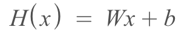
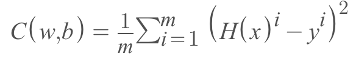
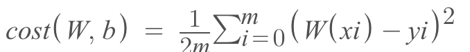
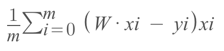
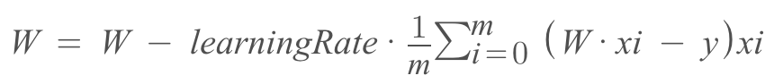

### 2023/02/28
## Linear Regression

### 2023/03/04

#### What is Regression
Regression means the power or tendency that tries to go to the mean of given dataset. Linear regression find a line that represent the data set.

#### What is Linear Regression
Linear Regression divide given data set in half

#### Key Vocabs
- Weights: Weight is a variable that affects next training and gives more weights for certain judgement of AI. 
- Bias: It can be considered as default value that helps to judge given data set.
- Cost: Difference between real values and values made by hypothesis(aka Model).

### Hypothesis & Cost of Linear Regression
#### Hypothesis

#### Cost

### Goal
By getting cost we can tell how hypothesis is close to the data set. 
By getting the lowest cost we can get the closest hypothesis values.
Thus, we can find a right `W(weight) and b(bias)` that represents the data set the most.

### Step By Step
1. Creating variables for weight(`w`) and bias(`b`), and training data based on `x_data`(given inputs) `y_data`(values to compare)
2. Start training using for loop
3. By using gradient descent we need to figure out new weight and bias
4. By multiplying learning rate and using `assign_sub`(A = A-B), we get new weight and bias
5. Repeat 3 and 4 until we find weight and bias that gives us the lowest cost.
6. Now we have weight and bias that can predict new y if new x is given.

### 2023/03/06
## Gradient Descent for linear regression
After we calculated cost based on the hypothesis model, it is important to update W and b.
Since we need the right W and b values that results the lowest cost. Then how?
For this  we need to use Gradient Descent Algorithm. Gradient Descent Algorithm changes value of W by the gradient.
And this will lead us to get the local minimum(not global minimum).
We can get gradient by derivative function of cost function.
For linear regression we will use this cost function to get the derivative. 

This is new cost function after removing bias at the hypothesis.
If we get the derivative of the new cost function respect to W. It looks like the one in below.

Now we can make Gradient Descent Algorithm like this.

Learning rate is most likely less than 1 ,and it is about how much we want to apply.
This is already implemented as `tape.gradient()` in tensorflow.

Gradient Descent is derivative of cost function.

#### Conclusion: Gradient Descent Algorithm the finds lowest cost 