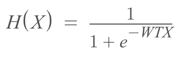
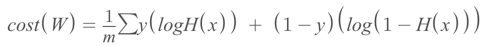
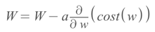

# 20230314
## Logistic Regression
Linear regression finds(or draws) a line that represents the given data the most.

Logistic regression finds(or draws) a line that split the given data the most.

For linear regression it will predict scalable result for the new given data.

While logistic regression will classify the new value into two different states.
For this logistic regression classify them 0 to 1 encoding. 

Thus, hypothesis of logistic regression should not be more than 1 and less than 0. To get the right value between 0 and 1, logistic regression use sigmoid function.

**Sigmoid function** turn high values into as close as possible to 1 and low values into as close as 0.
Even still this requires a standard to classify into two different states. For this we need **Decision Boundary**.

### Hypothesis H(X)

T is transpose for matrix calculation.

### Cost function

Instead of having two if statements, we can use this formula.

### Gradient Descent

Gradient Descent is derivative of cost(W) respect to W.